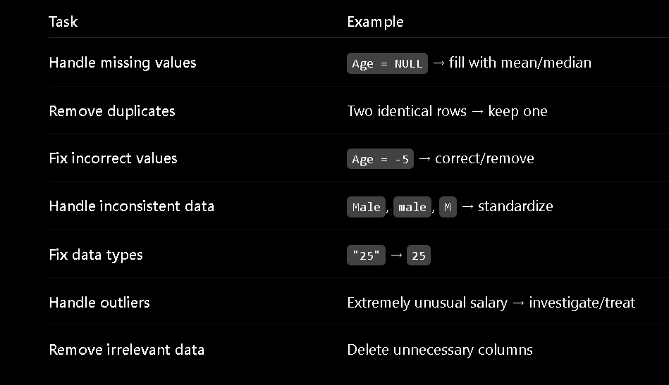
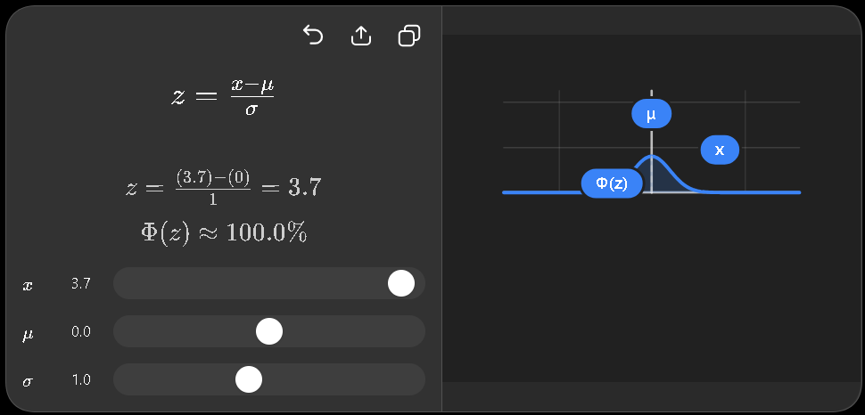

# Data Cleaning

## What is Data Cleaning ? 

Data cleaning is the process of finding and fixing or removing incorroct, incomplete, inconsistence and duplicate to ***improve data quality*** before building a Machine Learning model. 

Common data cleaning tasks are:




## Steps of Data Cleaning

### 1. Handling missing (null) values 

- Find the rows or colums that have missing (null) values
- Delete the null values row or colums if they are few
- Fill them with mean, median and mode 


    Mean/Median → for continuous or numerical data  
    Mode → for categorical data

    For eg:

    | Age  | Salary | Gender |
    |------|--------|--------|
    | 22   | 25000  | Male   |
    | 25   | NULL   | Female |
    | NULL | 32000  | Male   |
    | 28   | 40000  | NULL   |
    | 31   | 45000  | Female |

 
    There are null values in `Age`,` Salary` and `Gender`. `Age` and `Salary` column will be filled with `mean/median` and `Gender` column will be filled with `mode` since it is a `categorical`(qualitative) data.

<br>

- They can also be fiilled with `Linear Regression`, `KNN` or `Interpolation`


### 2. Removing Duplicate Data
Remove the exact same two rows.

### 3. Fix Data Types
In this step the wrong datatypes are fixed. For eg: if `age = "25"` then it should be converted into integer. If `date is "03/05/2026"` then it should be converted to date object.

### 4. Remove Inconsistent Data
In this the inconsistent data like: `Male, male, M` or `Yes, YES, y` is converted to a common values. 

To fix them, we `unify` them to one format. 

### 5. Remove Logical or Domain Error
In this  the logical error is removed. For eg: `age` cannot be `-5`. The `BMI` of any person cannot be `400`. 

To fix them we use mean or median or simply remove them.

### 6. Detect and Handle Outlier
`Outlier`: Outlier is the value which is far away from most of our dataset.

First, detect unusual values using:
- Boxplot
- IQR
- Z-score

Then decide how to handle them:
- Correct → if it is a data-entry/measurement error
- Capping (to 95%) → if the value is valid but extremely large/small
- Keep → if it is a legitimate observation
- Remove → if the value is clearly incorrect

>NOTE:
> In ML the outlier is usually not removed because may there can be some good perdiction because of the outlier. 

#### Boxplot
A boxplot is a visualization that helps you see unusual values.

For example:


```text
            Normal values                    Outlier

    |------------------------------|           •
    30   40   50   60   70   80    90         250
```

The points that appear far outside the normal range are potential outliers.

#### IQR
So IQR (Interquartile Range) is a mathematical method for identifying outliers. It tells us the spread of the middle 50% of our data. IQR ignores the lowest 25% and highest 25% and looks at the middle 50%.

```text
  25%          50%           25%
--------|----------------|--------
 lowest    middle 50%      highest

 ```

 We find the lower boundary and upper boundary of the range and then any value outside it considered as the outlier. 

 #### Z-score
Z-score tells us how far a value is from the mean, measured in standard deviations.



For example, a Z-score of 3 means the value is 3 standard deviations above the mean.

>A common rule is:
>- Z > +3  → potential outlier
>- Z < -3  → potential outlier

>NOTE: This method works particularly well when the data is approximately ***normally distributed***.


## Important Point

- EDA tells what is wrong with the data.
- Data cleaning fixes it. 

>NOTE: 80% OF WORK IS DONE BY DATA CLEANING BEFORE BUILDING A ML MODEL. 